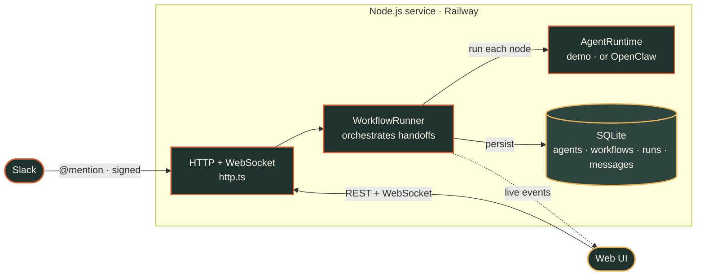

# Agent Orchestration — Architecture

High-level view of the deployed app the demo reel walks through.

- **Front doors** — a React single-page dashboard (REST + WebSocket) and a Slack
  ingress endpoint (`POST /slack/events`, HMAC signature-verified) both feed the
  same engine.
- **Engine** — one Node.js service (`http.ts`) hosts the HTTP + WebSocket server,
  the `WorkflowRunner` that orchestrates agent-to-agent handoffs (and pauses for
  approval), and the pluggable `AgentRuntime` (demo mock, or a real OpenClaw
  subprocess in production). It streams live run events back to the UI.
- **Data** — SQLite (Node's built-in `node:sqlite`) persists agents, workflows,
  runs, and the full message trail.
